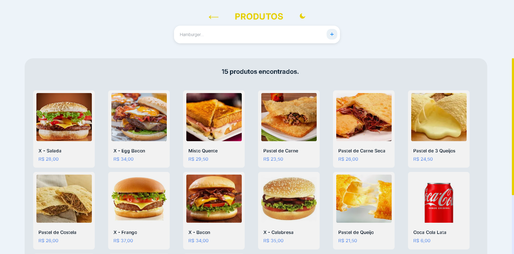
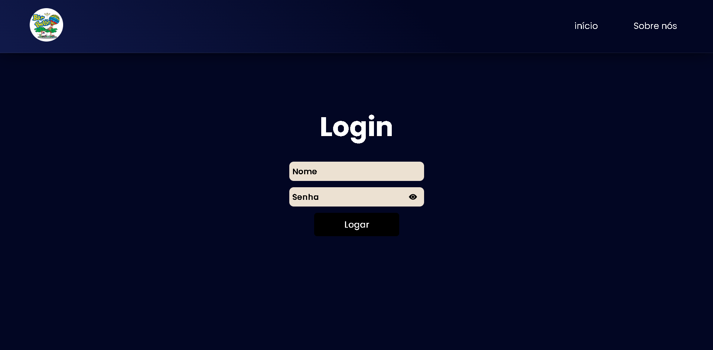
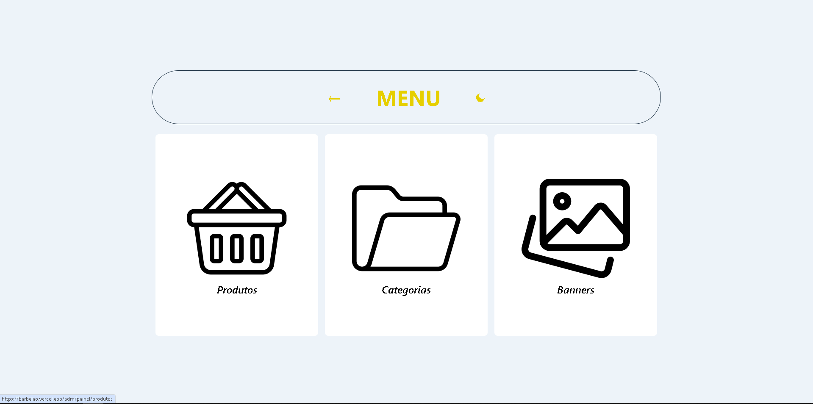

# Bar Balão - Plataforma Web


> Plataforma web para divulgação, cardápio digital e atendimento online do Bar Balão, desenvolvida como projeto acadêmico para o curso de Análise e Desenvolvimento de Sistemas do IFSP - Câmpus Bragança Paulista.

## Sobre o Projeto

O *Bar Balão* é um empreendimento local em Águas de Lindóia que buscava modernizar seu atendimento. Este projeto visa ampliar a presença digital do bar, permitindo que clientes visualizem o cardápio e façam pedidos de forma ágil, além de oferecer aos gerentes um painel para controle de produtos.

A solução foca na *praticidade* para o cliente final (pedidos via WhatsApp) e na *autonomia* para o proprietário (CRUD de produtos, categorias e banners).

---

## Funcionalidades

### Para o Cliente
- *Cardápio Digital:* Visualização de Lanches, Pastéis e Porções com fotos e descrições.
- *Carrinho de Compras:* Adição de itens e cálculo automático do total.
- *Integração com WhatsApp:* Ao finalizar o pedido, o cliente é redirecionado para o WhatsApp do bar com a lista de itens já formatada.
- *Busca e Filtros:* Facilidade para encontrar produtos específicos.

### Para o Administrador (Gerente)
- *Login Seguro:* Acesso restrito à área administrativa.
- *Gestão de Produtos, Categorias e Banners:* Cadastro, edição e exclusão de itens do cardápio.
- *Dashboard:* Visão geral das categorias e banners do site.

---

## Tecnologias Utilizadas

O sistema foi desenvolvido utilizando a seguinte arquitetura:

* *Front-end:* ReactJS, HTML, CSS, JavaScript (Vite).
* *Back-end:* Python.
* *Banco de Dados:* postgresql.
* *Host:* Render.
* *Ferramentas:*
  - **ReactJS**: Biblioteca para construção da interface do usuário.
  - **React Router**: Gerenciamento de rotas.
  - **Axios**: Comunicação com a API.
  - **CSS Modules**: Estilização modular e reutilizável.
  - **Vite**: Ferramenta de build para desenvolvimento rápido.

---

## Screenshots

| Tela Inicial | Produtos | Sobre Nós |
|:---:|:---:|:---:|
|  |  |   |

| Login | Menu Administrativo | Painel de Produtos | Painel de Categorias |
|:---:|:---:|:---:|:---:|
|  |  |  |  | 

> Observação: As imagens ilustrativas do projeto estão salvas na pasta assets.

---

## Estrutura do Projeto

```plaintext
Barbalao/
├── public/                 # Arquivos públicos (imagens, ícones, etc.)
├── src/                    # Código-fonte principal
│   ├── assets/             # Recursos estáticos
│   ├── Components/         # Componentes reutilizáveis
│   ├── pages/              # Páginas da aplicação
│   ├── Routes/             # Configuração de rotas
│   ├── App.css             # Estilos globais
│   ├── App.jsx             # Componente principal
│   ├── index.css           # Estilos globais adicionais
│   ├── main.jsx            # Ponto de entrada
├── .gitignore              # Arquivos ignorados pelo Git
├── index.html              # Arquivo HTML principal
├── package-lock.json       # Controle de versão das dependências
├── package.json            # Dependências e scripts do projeto
├── vercel.json             # Configuração de deploy no Vercel
├── vite.config.js          # Configuração do Vite
└── README.md               # Documentação do projeto
```

---

## Instalação e Execução

Este projeto é dividido em duas partes: Cliente (Front-end) e Servidor (Back-end/API).

### Pré-requisitos
* [Node.js](https://nodejs.org/) (v18+)
* API rodando em: [https://back-end-barbalao.onrender.com](https://back-end-barbalao.onrender.com)

## Rodando o front-End

```bash
# Clone o repositório
git clone https://github.com/seu-usuario/barbalao.git
cd barbalao

# Instale as dependências
npm install

# Execute o servidor de desenvolvimento
npm run dev

